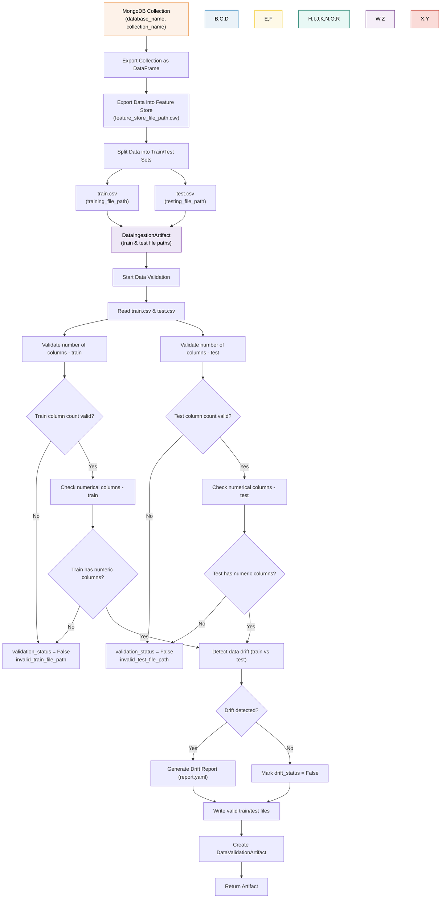

Heart Failure prediction

## 🔷 End-to-End Pipeline Flow (Data Ingestion → Data Validation)

```mermaid
flowchart TD
    %% Data Ingestion
    A["MongoDB Collection<br/>(database_name, collection_name)"] --> B["Export Collection as DataFrame"]
    B --> C["Export Data into Feature Store<br/>(feature_store_file_path.csv)"]
    C --> D["Split Data into Train/Test Sets"]
    D --> E["train.csv<br/>(training_file_path)"]
    D --> F["test.csv<br/>(testing_file_path)"]
    E --> G["DataIngestionArtifact<br/>(train & test file paths)"]
    F --> G

    %% Data Validation
    G --> H["Start Data Validation"]
    H --> I["Read train.csv & test.csv"]
    I --> J["Validate number of columns - train"]
    I --> K["Validate number of columns - test"]

    J --> L{"Train column count valid?"}
    K --> M{"Test column count valid?"}

    L -- No --> X["validation_status = False<br/>invalid_train_file_path"]
    M -- No --> Y["validation_status = False<br/>invalid_test_file_path"]

    L -- Yes --> N["Check numerical columns - train"]
    M -- Yes --> O["Check numerical columns - test"]

    N --> P{"Train has numeric columns?"}
    O --> Q{"Test has numeric columns?"}

    P -- No --> X
    Q -- No --> Y

    P -- Yes --> R["Detect data drift (train vs test)"]
    Q -- Yes --> R

    R --> S{"Drift detected?"}
    S -- Yes --> T["Generate Drift Report (report.yaml)"]
    S -- No --> U["Mark drift_status = False"]

    T --> V["Write valid train/test files"]
    U --> V

    V --> W["Create DataValidationArtifact"]
    W --> Z["Return Artifact"]

    %% Styles
    style A fill:#fdf2e9,stroke:#e67e22,color:#000
    style B,C,D fill:#eaf2f8,stroke:#2980b9,color:#000
    style E,F fill:#fef9e7,stroke:#f1c40f,color:#000
    style G fill:#ede7f6,stroke:#6a1b9a,color:#000
    style H,I,J,K,N,O,R fill:#e8f8f5,stroke:#117864,color:#000
    style W,Z fill:#f5eef8,stroke:#6c3483,color:#000
    style X,Y fill:#fadbd8,stroke:#c0392b,color:#000
```
